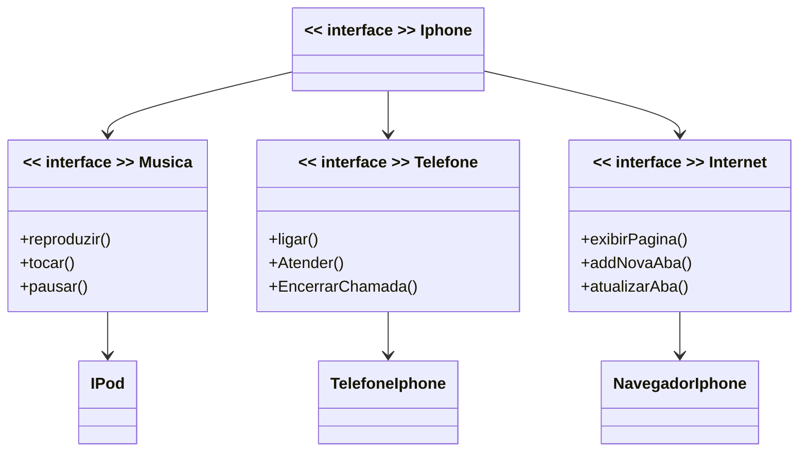

## Diagrama MERMAID

```mermaid
classDiagram
Iphone --> Musica
Iphone --> Telefone
Iphone --> Internet

class Iphone["<< interface >> Iphone"]
class Musica["<< interface >> Musica"]
class Telefone["<< interface >> Telefone"]
class Internet["<< interface >> Internet"]

Musica : +reproduzir()
Musica : +tocar()
Musica: +pausar()

Telefone: +ligar()
Telefone: +Atender()
Telefone: +EncerrarChamada()

Internet: +exibirPagina()
Internet: +addNovaAba()
Internet: +atualizarAba()

Musica --> IPod
Telefone --> TelefoneIphone
Internet --> NavegadorIphone
  
```
